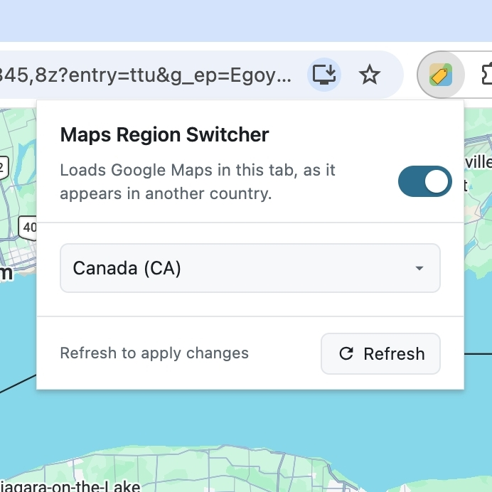
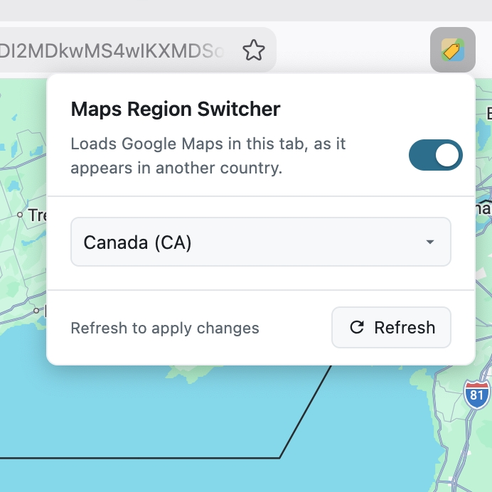

# Maps Region Switcher

A Chrome extension and Firefox add-on that loads Google Maps as it appears in another
country, by setting Google's own `gl` region parameter.

## Install

### Chrome

https://chromewebstore.google.com/detail/maps-region-switcher/fmbelciakdlpbepnbjefifbjaopmgcfd

### Firefox

(Pending Mozilla approval...)

The motivating case: Google Maps renders certain place names, labels, and
other content differently depending on which region it associates with your
view. That variation is Google's own region-dependent behavior, not universal
across regions, so switching the region parameter changes which version you
see, using Google's own rendering for that region, not a workaround or an
overlay.


<sup>Google Maps at `gl=CA`, rendered by Google exactly as it serves the map to
Canada. The extension only asks for that version, it does not draw anything.</sup>

## Why this approach?

Google Maps draws basemap labels into a WebGL canvas from vector tiles. There
is no DOM node to rewrite, so the obvious approaches like overlaying a replacement
label or patching the tiles which intersect the feature, won't work (and won't stay
within the Google Maps terms of use).

Setting the region instead produces Google's own rendering with correct font,
halo, placement, line-breaking, at every zoom level, and it keeps working when
Google changes its internals. It also modifies none of Google's content, which
matters for both the Maps terms and store review.

Verified against live Google Maps rendering, 2026-08-30: adding `?gl=<region>`
to a Maps URL changes region-dependent content exactly as Google serves it for
that region, including certain place labels, attribution text, and interface
language, with no additional handling required on the extension's part.

## Install without an extension store

Mainly useful for Firefox before the AMO listing is approved, or to try the
latest `dev` branch in Chrome ahead of a Web Store release. This needs a
build step -- clone the repo and run `npm run build:chrome` and/or
`npm run build:firefox` first (see Layout below); each produces a
`dist/<target>/` folder plus a `dist/maps-region-switcher-<version>-<target>.zip`,
both gitignored scratch output, not committed to the repo.

### Chrome

1. Type `chrome://extensions` into the address bar and press Enter.
2. Turn on **Developer mode**, the toggle in the top-right corner.
3. Click **Load unpacked** and select the `dist/chrome` folder.
4. The extension appears in your list, with its icon in the toolbar's
   puzzle-piece overflow menu. Click the pin icon next to it to keep it
   visible.

Chrome shows a one-time banner warning that "Developer mode extensions" are
less safe -- expected for anything installed outside the Web Store. Leave
Developer mode turned on; switching it off disables sideloaded extensions.

### Firefox

1. Type `about:debugging#/runtime/this-firefox` into the address bar and
   press Enter.
2. Click **Load Temporary Add-on...** and select `dist/firefox/manifest.json`.
3. The extension loads immediately and its icon appears in the toolbar. Pin
   it the same way as any other Firefox toolbar icon.

The catch: this is a *temporary* install, and Firefox removes it the next
time the browser fully quits and reopens -- you'll repeat these steps (build
included) each session until the AMO listing is approved. That's a Firefox
restriction on unsigned extensions, not something this project can work
around.

**Want it to survive restarts before the listing is approved?** Install
[Firefox Developer Edition](https://www.mozilla.org/firefox/developer/) or
Nightly instead of regular Firefox -- release Firefox always enforces
signature checks and cannot skip this step:
1. Type `about:config`, accept the risk warning, and search for
   `xpinstall.signatures.required`.
2. Set it to `false`.
3. Go to `about:addons`, click the gear icon, choose **Install Add-on From
   File...**, and select `dist/maps-region-switcher-<version>-firefox.zip`.

## Toolbar icon

Clicking the icon opens a small panel whose first control is an on/off toggle;
the region picker sits below it and greys out while the extension is off.

| Chrome | Firefox |
| --- | --- |
|  |  |

The same popup, same code, in both browsers — `popup.js` picks the `browser` or
`chrome` namespace at runtime, so nothing in `src/` is browser-specific.
`Refresh` reloads the current Maps tab, since the region only applies on page
load.

The icon itself carries the state, with no text overlaid on it:

| Icon | Meaning |
| --- | --- |
| Color | On — Maps loads are being given the selected region |
| Grey | Off — the rules are removed and Maps is untouched |
| Color + red `!` | The rules failed to install; hover for the reason |

The error state deliberately keeps the color icon rather than going grey, so
"broken" never looks like "the user switched it off". State is read back from
`chrome.declarativeNetRequest.getDynamicRules()` (`browser.declarativeNetRequest.getDynamicRules()`
on Firefox -- background.js picks the right namespace at runtime, see Layout)
after every write, so the icon reflects the rules the browser actually holds
rather than what was intended.

## How it works

Two dynamic `declarativeNetRequest` rules, rebuilt from `chrome.storage.local`
(`browser.storage.local` on Firefox) whenever the popup changes a setting:

| Rule | Priority | Action | Matches |
| --- | --- | --- | --- |
| Guard | 2 | `allow` | Maps URLs that already have `gl=` |
| Redirect | 1 | `redirect` | Any top-level Maps navigation |

The redirect uses `queryTransform.addOrReplaceParams`, so it only ever touches
the query string — Maps keeps its `!`-encoded data in *path* segments, which are
left alone. It applies to every Maps load, everywhere — there is no scoping.

An earlier version restricted the redirect to a small set of hard-coded map
viewports, on the theory that changing `gl` invalidated the basemap tile
cache and caused the map to blank while zooming. Both parts of that turned
out wrong: the blanking happens with the extension disabled too (it's Google
Maps' own rendering), and the scoped rule rarely fired anyway, because Maps is
a single-page app — searching or panning to a new place doesn't produce a new
navigation for a URL-based rule to match. The option was removed rather than
left as a checkbox that mostly did nothing.

The region parameter does still change the basemap tile URLs:

```
no gl:   ...!3i792558794!3m8!2sen!3sus!5e1105!12m4...
gl=CA:   ...!3i792558794!3m7!2sen!5e1105!12m4...
                         ^^^ region field gone
```

That's real and inherent — different labels require different tiles — but it's
a one-time refetch per tile, not the zoom-blanking behaviour above.

The guard rule is the loop protection. Without it we would be relying on the
browser silently dropping a redirect whose transform yields an identical URL;
an explicit higher-priority `allow` is the deterministic way to stop processing
a request that has already been rewritten.

The region has to be present on the **initial document request**, which is why
this is DNR and not a content script — a content script runs long after the
region has been resolved.

## Testing

After loading unpacked:

1. **Baseline.** Turn the extension off in the popup, open
   `https://www.google.com/maps/@43.65,-77.90,8z`, and note how the map renders.
2. **Effect.** Turn it on (region Canada), reload the same URL, and confirm a
   region-dependent label or attribution detail has changed to match the
   selected region.
3. **No redirect loop.** This is the one failure mode worth checking explicitly.
   Reload the Maps tab several times and navigate between a few places. You must
   never see a redirect-loop error page (Chrome shows `ERR_TOO_MANY_REDIRECTS`;
   Firefox shows "The page isn't redirecting properly"). Confirm the guard rule
   is installed:

   **Chrome** — open `chrome://extensions`, click the extension's *service
   worker* link to open its console, and run:

   ```js
   await chrome.declarativeNetRequest.getDynamicRules()
   ```

   **Firefox** — open `about:debugging#/runtime/this-firefox`, click
   **Inspect** next to the loaded extension to open its toolbox, switch to the
   Console tab, and run:

   ```js
   await browser.declarativeNetRequest.getDynamicRules()
   ```

   Either way, expect two rules, ids `1` and `2`.
4. **Rule matching.** `npm test` — or `node tools/test-rules.mjs` — checks both
   regexes against a corpus of real Maps URL shapes without needing a browser.

Note that Google strips `gl` from the address bar after load (via
`replaceState`). That is cosmetic; the region is already applied. Because Maps
is a single-page app, panning and searching after load keep the region in
memory — only full reloads re-trigger the rule.

## Settings storage

Settings live in `chrome.storage.local` (`browser.storage.local` on Firefox),
deliberately not `storage.sync`. A cold `storage.sync` read waits on the
browser's account sync engine and can take several seconds; that latency sat
directly in front of the popup's first render, so the toggle showed no state
until it resolved. Three local preferences are not worth a multi-second popup,
so they no longer follow you between devices.

### Popup first paint

`chrome.storage.local` (`browser.storage.local` on Firefox) is async, and its
first call in a browser session pays the backing store's cold-open cost, which
sat directly in front of the toggle showing any state.

So the popup keeps a `localStorage` mirror of the settings. localStorage is
synchronous and available to extension pages, so the toggle renders correct in
its first frame and the async read reconciles behind it.

The mirror is written on every save and after every authoritative read, and the
popup is the only writer of settings, so a stale frame would require the store
to change between two opens. It degrades safely: a missing or unreadable mirror
just falls back to the async path.

A `schemaVersion` migration in `background.js` carries values over from the old
sync store on first run after upgrading.

## Known trade-off

`gl` sets your **region**, not one label. Expect other region-dependent
behaviour to change too: the attribution bar switches to the selected country's
terms links, other place names change, and local business results skew
toward that country, and label language follows the region (`gl=MX` renders a
Spanish interface). That is inherent to the mechanism, which is why the popup
exposes an explicit toggle and region picker rather than silently rewriting
every Maps load.

## Layout

One `src/` tree, shared by both browsers -- `background.js` and `popup.js`
pick `browser` (Firefox) or `chrome` (Chrome) at runtime, so nothing in `src/`
is browser-specific. Only the manifest differs, which is why it lives outside
`src/` as two versions, merged in at build time.

```
src/
  background.js     service worker (Chrome) / event page (Firefox)
  rules.js          rule construction + the two regexes
  defaults.js       default settings and the region list
  popup.html/.js    toolbar UI
  icons/            generated PNGs (color, plus -off grey variants)
manifests/
  manifest.chrome.json    background.service_worker
  manifest.firefox.json   background.scripts + browser_specific_settings
tools/
  build.mjs           assembles dist/chrome/ and dist/firefox/ from the above,
                      and zips each into dist/maps-region-switcher-<ver>-<target>.zip
  make_icons.py       regenerates both icon sets (stdlib only)
  test-rules.mjs      regex corpus test + manifest/asset checks (both targets)
dist/               build output, gitignored -- run `npm run build` (or
                    `build:chrome` / `build:firefox` for a single target)
```

## License

MIT — see [LICENSE](LICENSE).
